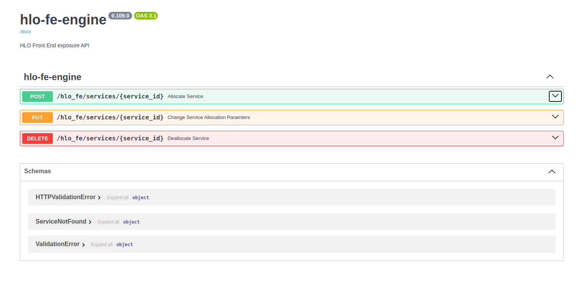
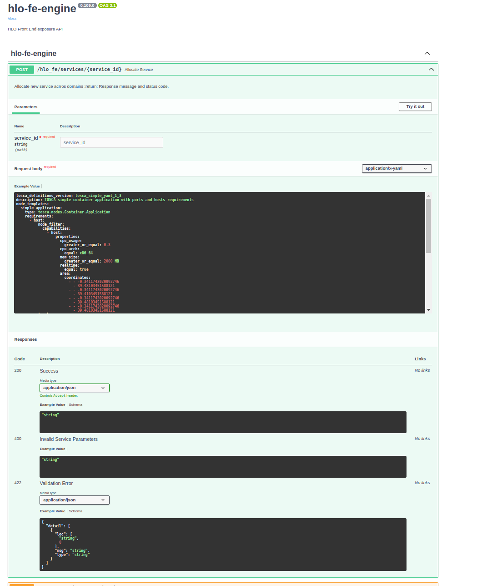

# HLO Front End
Component of the HLO responsible for exposing HLO REST API.

## Description
Exposing endpoints for cross-domain service LCM.
Receives TOSCA modeled service deployment request and initiates service orchestration accros aeriOS domains
Upon new request, TOSCA yaml is parsed and pushed to domain CB. Service id is pushed to HLO data aggregator.
Upon update request, TOSCA yaml is parsed and pushed to domain CB. Service id is pushed to HLO data aggregator.
Upon delete request, CB is upadated with service deallocation. Service id is pushed to HLO data aggregator.

## Visuals
| HLO FE EP  | HLO FE EP openAPI |
|----------|----------|
|   |     |


## Usage
For development, 
   * git clone
   * cd hlo-frontend
   * python3 -m venv venv
   * pip install -r requirments
   * source venv/bin/activate
   * uvicorn main:app --reload
   * test APIs using the FastAPI swagger page, example Tosca included 
    
   * or test APIs using POSTMAN collection included (HLO-FE-Engine.postman_collection.json)
   * for testing APIs either connect with MVP RedPanda broker or disable broker registration and message publishing


## Installation
For deploying in aeriOS domain.Easier when using Makefile. 
Edit variables, if needed, and :

* Build and tag docker image
```
 make build
```
* Push to aeriOS repository
```
 make push
```
* Package and upload helm chart
```
 make helm-upload
```
* Deploy against cluster chosen as current k8s context
```
 make deploy
```
* All the above
```
 make all
```
* Removes docker image
```
 make clean-build
```
* Removes the helm deployment from the cluster
```
 make clean-deploy 
```
* Removes all the above
```
 make clean-all 
```
## Authors and acknowledgment
Vasilis Pitsilis, Andreas Sakellaropoulos @aeriOS team

## Support
Please use Mattermost T3.3 channel,
or mail to vpitsilis@dat.demokritos.gr, vpitsilis@iit.demokritos.gr, asakellaropoulos@iit.demokritos.gr

## License
Copyright 2023.

Licensed under the Apache License, Version 2.0 (the "License"); you may not use this file except in compliance with the License. You may obtain a copy of the License at

    http://www.apache.org/licenses/LICENSE-2.0

Unless required by applicable law or agreed to in writing, software distributed under the License is distributed on an "AS IS" BASIS, WITHOUT WARRANTIES OR CONDITIONS OF ANY KIND, either express or implied. See the License for the specific language governing permissions and limitations under the License.


